  
  
  
  

  

 

## 🛣️ The Journey

<b>📖 Expand the full story (education + experience)</b>

 

**🎓 Education**
BSCS, University of Central Punjab — Lahore, 2024

**💼 Experience**

- **CODOOKO** — PHP/Laravel Intern *(2023, 5th semester)*
  Joined a small private company as an intern, worked on live client projects with PHP & Laravel.

- **Fiverr** — Freelance Web Developer *(2023–2024)*
  Completed 80+ orders, all 5-star, building web apps and client sites — mainly PHP/Laravel.

- **Independent Client (Florida, USA)** — Full Stack Developer *(2024)*
  Built a real estate web application solo, end-to-end, over ~1 year — this led directly to my current role.

- **State Listings / My State MLS** — Team Lead & Full Stack Developer *(2024–Present)*
  Leading a 4-person team building an E-Signature & form-conversion platform from scratch, integrated with the company's CRM. Own backend/database architecture, manage AWS deployments, and contribute to the React frontend.

 

## 🚀 Featured Work

<table>
<tr>
<td width="50%" valign="top">

**🖋️ E-Signature & Form Platform**
Built from scratch for **State Listings / My State MLS** — document e-signing + form conversion, integrated with their core CRM.

`Laravel` `MySQL` `React` `AWS`
*Team lead · 4 engineers*

</td>
<td width="50%" valign="top">

**🏠 Real Estate Web App**
Solo-built full stack platform for a Florida client — architecture to delivery, ~1 year, one person.

`PHP` `Laravel` `MySQL` `Bootstrap`
*Solo project*

</td>
</tr>
</table>

 

## 🐍 Contribution Snake

 

## 📡 Let's Connect

  

